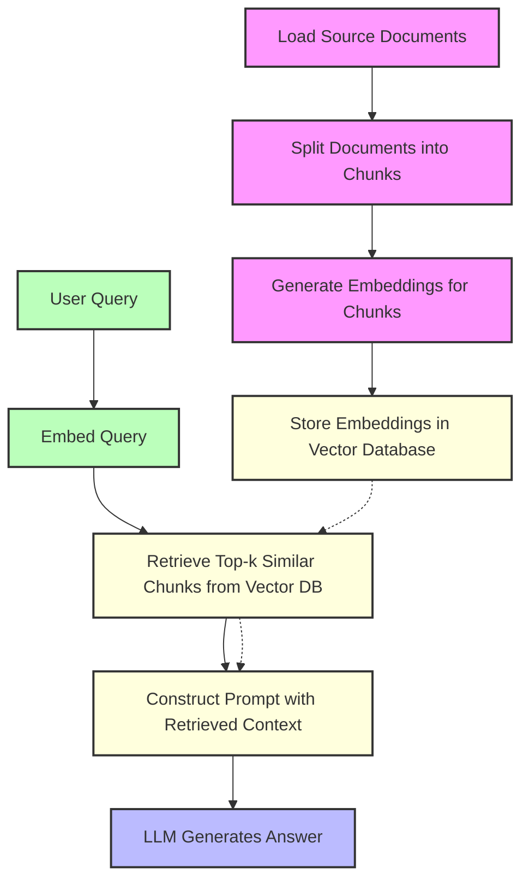

## RAG Process Diagram

The following diagram illustrates the complete RAG (Retrieval Augmented Generation) process:

This diagram shows the two main phases:
1. **Preprocessing Phase** (A→B→C→D): Documents are loaded, chunked, embedded, and stored
2. **Query Phase** (E→F→G→H→I): User queries are processed, relevant chunks retrieved, and answers generated 